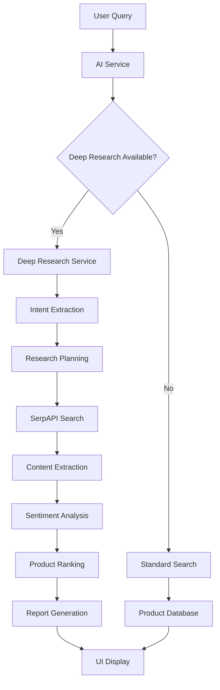

# 🔍 Deep Research Setup Guide

## Overview

The Walmart 2025 Shopping Assistant now includes **Deep Research** functionality, an advanced AI-powered system that autonomously researches products from across the open web. This transforms your assistant from using static database queries to conducting intelligent, real-time research.

## 🌟 Key Features

### Deep Research Capabilities
- **Autonomous Web Search**: Uses SerpAPI to search across multiple shopping sites
- **AI-Powered Analysis**: Leverages Google Gemini for intent classification and sentiment analysis
- **Citation-Rich Responses**: Provides source links and methodology transparency
- **Multi-Criteria Ranking**: Combines rating, price, and sentiment analysis
- **Real-Time Processing**: Live web data for up-to-date product information

### Architecture Overview
```
User Query → Intent Classification → Research Planning → Web Search → 
Content Extraction → Sentiment Analysis → Ranking → Report Generation
```

## 🚀 Quick Start

### Prerequisites
- Node.js 18+ and npm/yarn
- Two API keys:
  - **SerpAPI** (for web search)
  - **Google Gemini API** (for AI analysis)

### 1. Get Your API Keys

#### SerpAPI Setup
1. Visit [serpapi.com/users/sign_up](https://serpapi.com/users/sign_up)
2. Create a free account
3. Navigate to your dashboard
4. Copy your API key
5. **Free tier**: 100 searches/month

#### Google Gemini API Setup
1. Go to [Google AI Studio](https://makersuite.google.com/app/apikey)
2. Sign in with your Google account
3. Click "Create API Key"
4. Copy the generated key
5. **Free tier**: Generous usage limits

### 2. Configure the Application

#### Option A: Using the UI (Recommended)
1. Start the application: `npm run dev`
2. Navigate to the chat interface
3. Click the "AI Settings" button in the header
4. Go to the "Deep Research Configuration" section
5. Enter your SerpAPI and Gemini API keys
6. Test the connections
7. Save settings

#### Option B: Environment Variables
Create a `.env.local` file in your frontend directory:
```env
NEXT_PUBLIC_SERP_API_KEY=your_serpapi_key_here
NEXT_PUBLIC_GEMINI_API_KEY=your_gemini_key_here
```

### 3. Test Deep Research

Try these example queries:
- "Find me the best coffee under ₹500"
- "Show me top rated headphones"
- "Best gaming laptop under $1000"
- "Compare highly rated smartphones"

## 🏗️ Architecture Deep Dive

### Components Overview

#### 1. Deep Research Service (`deepResearchService.ts`)
The core engine that orchestrates the entire research process:
- **Intent Extraction**: Parses user queries into structured research intents
- **Research Planning**: Creates optimized search strategies
- **Web Search**: Executes searches via SerpAPI
- **Content Processing**: Extracts product information from search results
- **Sentiment Analysis**: Uses Gemini to analyze product reviews
- **Ranking Algorithm**: Combines multiple factors for product scoring

#### 2. AI Service Integration (`aiService.ts`)
Enhanced to automatically detect product research queries and route them to Deep Research:
- **Intent Classification**: Determines when to use Deep Research
- **Fallback Handling**: Gracefully degrades to standard search if needed
- **Response Generation**: Formats Deep Research results for the UI

#### 3. UI Components
- **DeepResearchResults**: Rich display component for research results
- **AISettings**: Configuration interface for API keys
- **MessageComponent**: Updated to handle Deep Research message types

### Data Flow



## 🔧 Configuration Options

### Deep Research Service Configuration
```typescript
// Default settings - can be customized
const config = {
  maxProducts: 10,           // Maximum products to analyze
  sentimentThreshold: 0.5,   // Minimum sentiment score
  searchTimeout: 30000,      // Search timeout in ms
  rankingWeights: {
    rating: 0.4,            // Product rating weight
    sentiment: 0.3,         // Sentiment analysis weight
    price: 0.3              // Price competitiveness weight
  }
};
```

### Ranking Algorithm
Products are scored using a weighted combination:
- **Rating Score**: Normalized product rating (0-1)
- **Sentiment Score**: AI-analyzed review sentiment (0-1)
- **Price Score**: Inverse price competitiveness (0-1)

**Final Score = (Rating × 0.4) + (Sentiment × 0.3) + (Price × 0.3)**

## 🎯 Usage Examples

### Basic Product Search
```
User: "best coffee under 500"
→ Deep Research analyzes web results
→ Returns top coffee products with:
  - Price comparison
  - Rating analysis
  - Sentiment insights
  - Source citations
```

### Advanced Queries
```
User: "Samsung phone with good camera under $800"
→ Extracts constraints:
  - Brand: Samsung
  - Category: smartphone
  - Feature: camera quality
  - Price: ≤$800
→ Conducts targeted research
→ Provides detailed comparison
```

## 🛠️ Development

### Adding New Data Sources
To add support for new shopping sites, update the search queries in `createResearchPlan`:

```typescript
const queries = [
  `best ${category} site:amazon.in OR site:flipkart.com`,
  `${category} reviews site:amazon.in OR site:yoursite.com`,
  // Add more sites here
];
```

### Customizing Sentiment Analysis
Modify the sentiment analysis prompt in `analyzeSentiment`:

```typescript
const prompt = `
Analyze the sentiment and return a score 0-1:
"${text}"

Consider:
- Product satisfaction
- Quality mentions
- Price-value perception
- Overall recommendation likelihood

Return only the number.
`;
```

### Extending Entity Extraction
Add new entity types in `ENTITY_PATTERNS`:

```typescript
const ENTITY_PATTERNS = {
  // ... existing patterns
  warranty: [
    /\b(\d+)\s*(?:year|month)\s*warranty\b/gi
  ],
  storage: [
    /\b(\d+)\s*(?:gb|tb)\b/gi
  ]
};
```

## 🔍 Troubleshooting

### Common Issues

#### 1. API Key Errors
**Error**: "API key not configured"
**Solution**: 
- Verify API keys are correctly entered
- Check for extra spaces or characters
- Ensure keys have proper permissions

#### 2. Search Failures
**Error**: "Search failed for query"
**Solution**:
- Check SerpAPI quota limits
- Verify internet connection
- Try simpler search terms

#### 3. Sentiment Analysis Errors
**Error**: "Sentiment analysis failed"
**Solution**:
- Verify Gemini API key
- Check API quota
- Fallback will use neutral sentiment (0.5)

### Performance Optimization

#### 1. Caching
Implement Redis caching for:
- Search results (1 hour TTL)
- Sentiment analysis (24 hour TTL)
- Product data (6 hour TTL)

#### 2. Rate Limiting
Configure appropriate limits:
- SerpAPI: 100 requests/month (free tier)
- Gemini API: Monitor token usage
- Implement exponential backoff

#### 3. Parallel Processing
The service already processes multiple searches in parallel. For further optimization:
- Batch sentiment analysis requests
- Use Promise.allSettled for resilient parallel execution
- Implement request queuing for high traffic

## 📊 Monitoring & Analytics

### Key Metrics to Track
- **Research Success Rate**: % of successful deep research completions
- **Average Processing Time**: Time from query to results
- **API Usage**: Monitor quota consumption
- **User Engagement**: Click-through rates on research results

### Logging
The service includes comprehensive logging:
- Research pipeline progress
- API call success/failure
- Performance metrics
- Error tracking

## 🚀 Future Enhancements

### Planned Features
1. **Image Analysis**: Extract product images and analyze visual features
2. **Price Tracking**: Monitor price changes over time
3. **Review Summarization**: AI-generated review summaries
4. **Competitor Analysis**: Automatic product comparison matrices
5. **Voice Search**: Integration with speech recognition
6. **AR Try-On**: Virtual product visualization

### Scaling Considerations
- **Database Integration**: Store research results for faster retrieval
- **CDN Integration**: Cache product images and data
- **Microservices**: Split into separate services for different functions
- **Load Balancing**: Distribute API calls across multiple keys

## 📝 API Reference

### Deep Research Service Methods

#### `conductDeepResearch(userQuery: string)`
Main entry point for deep research functionality.

**Parameters:**
- `userQuery`: User's search query

**Returns:**
- `DeepResearchResponse`: Complete research results

#### `extractIntent(userQuery: string)`
Extracts structured intent from user query.

**Returns:**
- `ResearchIntent`: Structured intent with category, constraints, etc.

#### `createResearchPlan(intent: ResearchIntent)`
Creates optimized search strategy.

**Returns:**
- `ResearchPlan`: Search queries and extraction targets

## 🤝 Contributing

### Development Setup
1. Clone the repository
2. Install dependencies: `npm install`
3. Set up environment variables
4. Run development server: `npm run dev`

### Testing
```bash
# Run unit tests
npm test

# Test Deep Research functionality
npm run test:deep-research

# Integration tests
npm run test:integration
```

### Code Style
- Use TypeScript for type safety
- Follow ESLint configuration
- Add JSDoc comments for public methods
- Include error handling for all API calls

## 📄 License

This project is licensed under the MIT License. See LICENSE file for details.

## 🆘 Support

For issues and questions:
1. Check this documentation
2. Search existing GitHub issues
3. Create a new issue with:
   - Error logs
   - Steps to reproduce
   - Expected vs actual behavior
   - Environment details

---

**🎉 You're now ready to experience the power of Deep Research!**

The Walmart 2025 Shopping Assistant can now autonomously research products from across the web, providing you with comprehensive, citation-rich product recommendations backed by real-time data and AI analysis. 